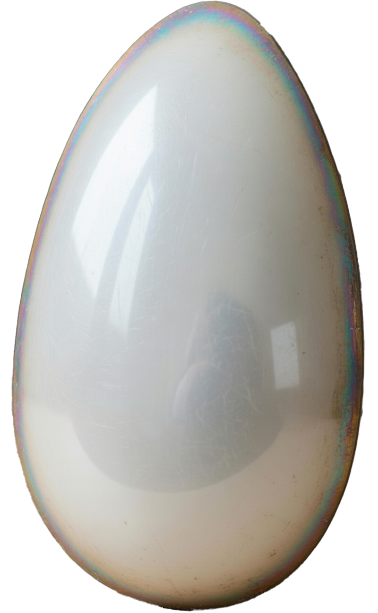

# Oval

A standalone video player that exists as a mysterious oval-shaped object on your desktop. Not a window — an object.

The visual identity crosses **MDK (1998)** with **Riven (2024 remake)**: a white pearl egg with oil-slick iridescent shimmer. Glossy biomechanical materiality meets ancient tactile technology.



## Current Status

**Sprint 1 complete** — the object exists.

- Transparent borderless egg-shaped window floating on the desktop
- Photorealistic pearl surface with iridescent rim (texture-based)
- Dynamic specular highlight that tracks the mouse
- Animated idle pulse
- Pixel-accurate hit-testing (clicks outside the egg pass through to desktop)
- Window dragging (click inside to pick up and move)
- macOS transparency via objc2 (NSWindow + CAMetalLayer configuration)

Video playback, controls, and audio are upcoming sprints.

## Tech Stack

| Layer | Technology |
|-------|-----------|
| Language | Rust |
| Windowing | winit 0.30 |
| GPU Rendering | wgpu 24 (Metal on macOS, DX12/Vulkan on Windows) |
| Shaders | WGSL |
| UI Controls | egui (planned — Sprint 3) |
| Video Decoding | ffmpeg-next (planned — Sprint 2) |
| Audio | cpal (planned — Sprint 5) |
| macOS Interop | objc2 |
| Windows Interop | windows-rs (planned) |

## Building

### Prerequisites

- Rust toolchain (stable)
- macOS or Windows

### Run

```bash
cd oval-player
RUST_LOG=info cargo run
```

Press **Escape** to quit. Click and drag to move.

## Project Structure

```
Oval/
├── README.md
├── CLAUDE.md                     # AI assistant project guide
├── egg--grok.png                 # Egg texture (shape mask + surface)
├── oval-player/
│   ├── Cargo.toml
│   └── src/
│       ├── main.rs               # App, wgpu init, event loop, rendering
│       └── shaders/
│           └── oval.wgsl         # Fragment shader (texture + dynamic specular)
├── research/
│   ├── MOJO_EVAL.md              # Mojo evaluation (rejected)
│   ├── VIDEO_TECH.md             # Video codec and decoding research
│   ├── WINDOW_SYSTEM.md          # Platform-specific window management
│   ├── UI_DESIGN.md              # Visual design and ASCII sketches
│   └── OBJC2_WINIT_INTEROP.md    # macOS transparency implementation
└── design/
    └── ARCHITECTURE.md           # System architecture and sprint plan
```

## Roadmap

| Sprint | Focus | Status |
|--------|-------|--------|
| 1 | Window + Oval Mask + Visual Identity | **Done** |
| 2 | Video Playback (ffmpeg-next, YUV textures) | Planned |
| 3 | Controls + Interaction (egui overlay, timeline, scrubbing) | Planned |
| 4 | Visual Polish (3D surface, texture refinement, drag-and-drop) | Planned |
| 5 | Hardware Acceleration + Audio (VideoToolbox, DXVA, cpal) | Planned |
| 6 | Cross-Platform QA (macOS + Windows, codec matrix) | Planned |

## Design Philosophy

**Priority hierarchy:**

1. Visual aesthetic fidelity — the look IS the product
2. Video quality
3. Performance (60fps+ target)
4. Code maintainability

The oval is not a window shape. It's an object. A luminous, iridescent thing on your desktop that happens to show video through it.

## License

TBD
